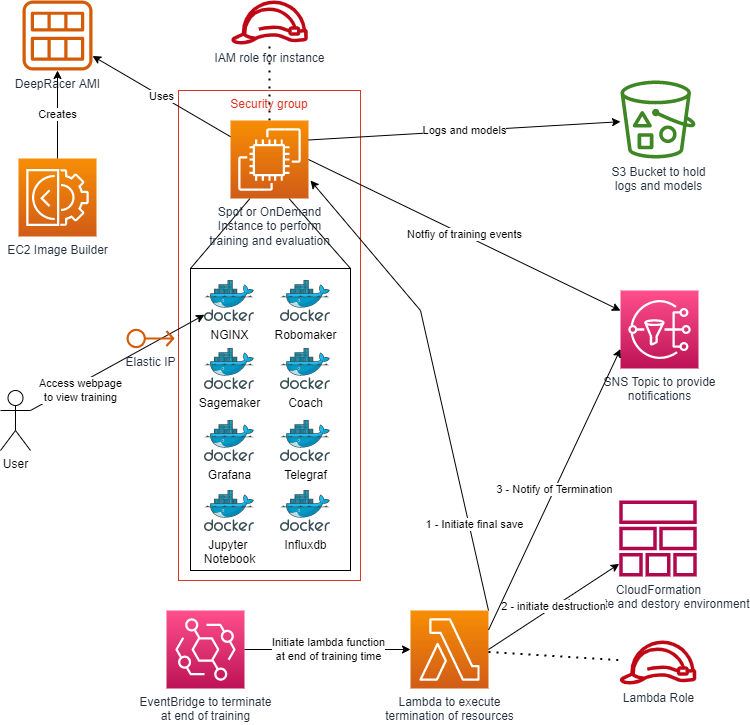

# ATLienHK AWS Hong Kong DeepRacer 2024 Files 🇭🇰

#      

## About

This README provides an overview of my current and future DeepRacer Models (v1 currently). The goal is basically to:

* Define an action space
* Develop a reward function
* Experiment with various hyperparameters
* Modify training times: Optimal turn speeds
* Test on different tracks: AWS DeepRacer Tracks

## Modifications

* Faster turning speed
* Easier handling of sharper turns

## Training Optimization Used from [deepracer-on-the-spot](https://github.com/aws-deepracer-community/deepracer-on-the-spot)

* Training URLS : `http://98.80.171.249:8100/menu.html` and `http://98.80.171.249:8080`
* Action space definitions
* Reward function templates
* Hyperparameter tuning scripts
* Training optimization techniques
* Track testing configurations